# 🏗️ Document Intelligence System - Architecture Diagram

## System Architecture (Mermaid)


---

## Data Flow Sequence Diagram

```mermaid
sequenceDiagram
    participant User as 👤 User
    participant Web as 🌐 Web/Mobile App
    participant API as ⚡ FastAPI
    participant Auth as 🔐 Auth Service
    participant DocRouter as 📄 Document Router
    participant BG as 🤖 Background Processor
    participant Agent as 🧠 AI Agent
    participant EasyOCR as 👁️ EasyOCR
    participant Gemini as 🌟 Gemini
    participant Classifier as 🎯 Classifier
    participant RuleEngine as ⚖️ Rule Engine
    participant DB as 💾 Database
    participant Storage as 📁 File Storage

    %% Authentication Flow
    User->>Web: Login
    Web->>API: POST /api/auth/login
    API->>Auth: Verify credentials
    Auth->>DB: Query users table
    DB-->>Auth: User data
    Auth-->>API: JWT Token + User details
    API-->>Web: Token + User info
    Web-->>User: Logged in ✅

    %% Document Upload Flow
    User->>Web: Upload Document
    Web->>API: POST /api/documents/upload<br/>[files, JWT token]
    API->>Auth: Verify JWT
    Auth-->>API: User authenticated ✅
    API->>DocRouter: Process upload
    DocRouter->>Storage: Save file
    Storage-->>DocRouter: File path
    DocRouter->>DB: Create document record
    DB-->>DocRouter: Document ID
    DocRouter->>BG: Trigger background task
    DocRouter-->>API: Upload response
    API-->>Web: {document_id, status, message}
    Web-->>User: "Uploaded Successfully"<br/>"Verification Pending"

    %% Background Processing Flow (AI Agent)
    Note over BG,Agent: Background Processing Starts
    BG->>Agent: Analyze document
    Agent->>Agent: Decide strategy<br/>(quality check first?)
    
    %% Quality Assessment
    Agent->>BG: Strategy: Check quality first
    BG->>Storage: Load document
    Storage-->>BG: File data
    BG->>BG: Quality Assessment<br/>(OpenCV: blur, skew, brightness)
    BG->>DB: Update quality scores
    
    alt Quality < 55%
        BG->>DB: Set status: FAIL<br/>Reason: Poor quality
        BG-->>User: Request re-upload ❌
    else Quality >= 55%
        Note over BG,Gemini: Continue Processing
        
        %% Concurrent Processing (3 parallel tasks)
        par OCR Extraction
            BG->>EasyOCR: Extract text
            EasyOCR-->>BG: Text + confidence
        and Gemini Analysis
            BG->>Gemini: Analyze image<br/>(text + signatures)
            Gemini-->>BG: Text + signature data
        and Quality Assessment
            BG->>BG: Calculate metrics
        end
        
        BG->>Agent: Combine OCR results
        Agent->>Agent: Text Fusion<br/>(EasyOCR + Gemini)
        Agent-->>BG: Best combined text
        
        %% Document Classification (3 Signals)
        BG->>Classifier: Classify document
        
        par Signal 1: Keyword Match
            Classifier->>Classifier: Keyword matching
        and Signal 2: Embedding Similarity
            Classifier->>DB: Fetch sample embeddings
            DB-->>Classifier: Sample data
            Classifier->>Classifier: Cosine similarity
        and Signal 3: Gemini Vision (if needed)
            Classifier->>Gemini: Vision classification
            Gemini-->>Classifier: Doc type + confidence
        end
        
        Classifier->>Classifier: Weighted voting<br/>(45% embed, 35% gemini, 20% keyword)
        Classifier-->>BG: Doc type + confidence
        BG->>DB: Update document_type
        
        %% Metadata Extraction
        BG->>Agent: Extract metadata
        Agent->>Gemini: Field extraction<br/>(BOL#, Order#, dates, etc.)
        Gemini-->>Agent: Extracted fields
        Agent-->>BG: Structured metadata
        BG->>DB: Update metadata fields
        
        %% Rule Validation
        BG->>RuleEngine: Validate document
        RuleEngine->>DB: Fetch validation rules
        DB-->>RuleEngine: Rules for doc type
        RuleEngine->>RuleEngine: Apply general rules<br/>Apply doc-specific rules
        
        alt Hard failure
            RuleEngine-->>BG: Status: FAIL<br/>Reason: Missing required field
            BG->>DB: Update: validation_status=FAIL
        else Soft warnings only
            RuleEngine-->>BG: Status: PASS<br/>Warnings: [...]
            BG->>DB: Update: validation_status=PASS
        else All passed
            RuleEngine-->>BG: Status: PASS
            BG->>DB: Update: validation_status=PASS
        end
        
        %% Final Update
        BG->>DB: Update is_processed=True<br/>Update all fields
        BG-->>User: Processing complete ✅
    end

    %% User Views Results
    User->>Web: View document
    Web->>API: GET /api/documents/{id}
    API->>DB: Fetch document + metadata
    DB-->>API: Complete data
    API-->>Web: Document details + display config
    Web-->>User: Show document details
```



---

## Component Architecture


---

## Database Schema


---

## Processing Pipeline Flow

```mermaid
flowchart TD
    START([📤 Document Uploaded]) --> SAVE[💾 Save File to Storage]
    SAVE --> CREATE_DB[📝 Create DB Record<br/>status: PENDING]
    CREATE_DB --> TRIGGER[🚀 Trigger Background Task]
    
    TRIGGER --> AGENT_START[🤖 AI Agent Starts]
    
    AGENT_START --> STRATEGY{🧠 Agent Decides Strategy<br/>Based on file size,<br/>format, type}
    
    STRATEGY -->|Large PDF| FAST_TRACK[⚡ Fast Track:<br/>Skip EasyOCR, Use Gemini only]
    STRATEGY -->|Poor Image| ENHANCED[🔧 Enhanced OCR:<br/>Use both EasyOCR + Gemini]
    STRATEGY -->|Standard| STANDARD[📋 Standard:<br/>Quality → OCR → Classify]
    
    FAST_TRACK --> Q1[🔍 Quality Check]
    ENHANCED --> Q2[🔍 Quality Check]
    STANDARD --> Q3[🔍 Quality Check]
    
    Q1 --> QUALITY_DECISION{Quality Score<br/>< 55%?}
    Q2 --> QUALITY_DECISION
    Q3 --> QUALITY_DECISION
    
    QUALITY_DECISION -->|Yes| REJECT[❌ Reject Document<br/>Request Re-upload]
    QUALITY_DECISION -->|No| PARALLEL_START[🔄 Start Concurrent Processing]
    
    REJECT --> UPDATE_FAIL[💾 Update DB:<br/>status=FAIL<br/>reason=Poor Quality]
    UPDATE_FAIL --> END_FAIL([🛑 End - Notify User])
    
    PARALLEL_START --> TASK1[Task 1: OCR Extraction]
    PARALLEL_START --> TASK2[Task 2: Signature Detection]
    PARALLEL_START --> TASK3[Task 3: Classification Prep]
    
    TASK1 --> OCR_EASY[👁️ EasyOCR<br/>Extract Text]
    TASK1 --> OCR_GEM[🌟 Gemini OCR<br/>Extract Text]
    OCR_EASY --> COMBINE[🔗 Combine Texts<br/>AI-powered fusion]
    OCR_GEM --> COMBINE
    
    TASK2 --> SIG_GEM[🌟 Gemini Vision<br/>Detect Signatures]
    SIG_GEM --> SIG_DATA[✍️ Signature Data:<br/>count, location, type]
    
    TASK3 --> PREP_CLASS[📊 Prepare for Classification]
    
    COMBINE --> COMBINED_TEXT[📝 Combined OCR Text]
    SIG_DATA --> UPDATE_SIG[💾 Update Signatures in DB]
    PREP_CLASS --> WAIT_OCR[⏳ Wait for OCR]
    
    WAIT_OCR --> COMBINED_TEXT
    COMBINED_TEXT --> CLASSIFY_START[🎯 Document Classification]
    
    CLASSIFY_START --> SIGNAL1[Signal 1: Keyword Match]
    CLASSIFY_START --> SIGNAL2[Signal 2: Embedding Similarity]
    CLASSIFY_START --> SIGNAL3[Signal 3: Gemini Vision]
    
    SIGNAL1 --> KEYWORD_RESULT[📝 Keyword confidence]
    SIGNAL2 --> EMBED_RESULT[🔗 Similarity score]
    SIGNAL3 --> GEMINI_RESULT[🌟 Vision confidence]
    
    KEYWORD_RESULT --> VOTE[🗳️ Weighted Voting<br/>45% embed + 35% gemini + 20% keyword]
    EMBED_RESULT --> VOTE
    GEMINI_RESULT --> VOTE
    
    VOTE --> CLASSIFY_RESULT{Confidence<br/>>= 50%?}
    
    CLASSIFY_RESULT -->|No| MANUAL_REVIEW[⚠️ Flag for Manual Review]
    CLASSIFY_RESULT -->|Yes| METADATA[📋 Metadata Extraction]
    
    MANUAL_REVIEW --> UPDATE_REVIEW[💾 Update DB:<br/>needs_manual_review=True]
    
    METADATA --> ENHANCED_EXTRACT[🎯 Enhanced Metadata Extractor<br/>Gemini-powered]
    ENHANCED_EXTRACT --> EXTRACT_FIELDS{Doc Type?}
    
    EXTRACT_FIELDS -->|BOL| BOL_FIELDS[Extract: BOL#, Order#,<br/>Shipper, Consignee, etc.]
    EXTRACT_FIELDS -->|POD| POD_FIELDS[Extract: Delivery date,<br/>Delivered to, Condition]
    EXTRACT_FIELDS -->|Invoice| INV_FIELDS[Extract: Invoice#,<br/>Amount, Payment terms]
    EXTRACT_FIELDS -->|Other| OTHER_FIELDS[Extract: Type-specific fields]
    
    BOL_FIELDS --> METADATA_DONE[📊 Metadata Extracted]
    POD_FIELDS --> METADATA_DONE
    INV_FIELDS --> METADATA_DONE
    OTHER_FIELDS --> METADATA_DONE
    
    METADATA_DONE --> VALIDATE[⚖️ Rule Validation]
    
    VALIDATE --> GENERAL_RULES[📏 Apply General Rules<br/>6 rules for all docs]
    GENERAL_RULES --> GENERAL_RESULT{All General<br/>Rules Pass?}
    
    GENERAL_RESULT -->|No - Hard Fail| FAIL_GENERAL[❌ FAIL<br/>Stop processing]
    GENERAL_RESULT -->|Yes| DOC_RULES[📏 Apply Doc-Specific Rules]
    
    DOC_RULES --> DOC_RESULT{All Doc<br/>Rules Pass?}
    
    DOC_RESULT -->|Hard Fail| FAIL_DOC[❌ FAIL<br/>Show reasons]
    DOC_RESULT -->|Soft Warnings| PASS_WARN[✅ PASS with Warnings]
    DOC_RESULT -->|All Pass| PASS_FULL[✅ PASS<br/>Billing Ready]
    
    FAIL_GENERAL --> UPDATE_DB_FAIL[💾 Update DB:<br/>validation_status=FAIL<br/>validation_result=reasons]
    FAIL_DOC --> UPDATE_DB_FAIL
    PASS_WARN --> UPDATE_DB_PASS[💾 Update DB:<br/>validation_status=PASS<br/>validation_result=warnings]
    PASS_FULL --> UPDATE_DB_PASS
    
    UPDATE_DB_FAIL --> LOG[📝 Log Processing Steps]
    UPDATE_DB_PASS --> LOG
    UPDATE_REVIEW --> LOG
    
    LOG --> NOTIFY[📧 Notify User<br/>Processing Complete]
    NOTIFY --> END_SUCCESS([✅ End - Document Ready])
    
    style START fill:#4CAF50,stroke:#333,stroke-width:3px,color:#fff
    style AGENT_START fill:#FF9800,stroke:#333,stroke-width:3px,color:#fff
    style PARALLEL_START fill:#2196F3,stroke:#333,stroke-width:2px,color:#fff
    style VOTE fill:#9C27B0,stroke:#333,stroke-width:2px,color:#fff
    style VALIDATE fill:#FF5722,stroke:#333,stroke-width:2px,color:#fff
    style END_SUCCESS fill:#4CAF50,stroke:#333,stroke-width:3px,color:#fff
    style END_FAIL fill:#F44336,stroke:#333,stroke-width:3px,color:#fff
```



---

## Technology Stack


---

## API Endpoint Structure

```mermaid
graph LR
    ROOT[/] --> INFO[API Information]
    HEALTH[/health] --> HEALTH_CHECK[Health Status]
    
    subgraph "Authentication APIs"
        AUTH_BASE[/api/auth]
        AUTH_BASE --> LOGIN[POST /login<br/>Get JWT Token]
        AUTH_BASE --> REGISTER[POST /register<br/>Create User]
        AUTH_BASE --> TOKEN[POST /token<br/>OAuth2 Compatible]
    end
    
    subgraph "Document APIs"
        DOC_BASE[/api/documents]
        DOC_BASE --> UPLOAD[POST /upload<br/>Single or Multiple Files]
        DOC_BASE --> LIST[GET /<br/>List Documents]
        DOC_BASE --> DETAIL[GET /{id}<br/>Document Details]
        DOC_BASE --> DELETE[DELETE /{id}<br/>Delete Document]
        DOC_BASE --> DOWNLOAD[GET /{id}/download<br/>Download File]
        DOC_BASE --> REPROCESS[POST /{id}/reprocess<br/>Re-run Processing]
    end
    
    subgraph "Validation Rule APIs"
        VAL_BASE[/api/validation-rules]
        VAL_BASE --> VAL_LIST[GET /<br/>List Rules]
        VAL_BASE --> VAL_CREATE[POST /<br/>Create Rule]
        VAL_BASE --> VAL_UPDATE[PUT /{id}<br/>Update Rule]
        VAL_BASE --> VAL_DELETE[DELETE /{id}<br/>Delete Rule]
    end
    
    subgraph "Analytics APIs"
        ANA_BASE[/api/analytics]
        ANA_BASE --> STATS[GET /stats<br/>Overview Statistics]
        ANA_BASE --> TYPE_DIST[GET /document-types<br/>Type Distribution]
        ANA_BASE --> VAL_STATS[GET /validation-stats<br/>Pass/Fail Rates]
    end
    
    subgraph "Sample Management APIs"
        SAM_BASE[/api/samples]
        SAM_BASE --> SAM_UPLOAD[POST /upload<br/>Upload Training Sample]
        SAM_BASE --> SAM_STATUS[GET /status<br/>Sample Counts]
        SAM_BASE --> SAM_LIST[GET /<br/>List Samples]
        SAM_BASE --> SAM_DELETE[DELETE /{id}<br/>Delete Sample]
    end

    style UPLOAD fill:#4CAF50,stroke:#333,stroke-width:2px
    style LOGIN fill:#2196F3,stroke:#333,stroke-width:2px
    style STATS fill:#FF9800,stroke:#333,stroke-width:2px
```

---

## AI Agent Decision Tree

```mermaid
flowchart TD
    START([🤖 AI Agent Receives Document])
    
    START --> ANALYZE[🔍 Analyze File Properties]
    ANALYZE --> SIZE{File Size?}
    
    SIZE -->|> 2 MB + PDF| STRATEGY_FAST[⚡ Strategy: FAST_TRACK<br/>Skip EasyOCR, Use Gemini only]
    SIZE -->|< 500 KB + Image| STRATEGY_ENHANCED[🔧 Strategy: ENHANCED_OCR<br/>Use both EasyOCR + Gemini]
    SIZE -->|Standard| STRATEGY_STANDARD[📋 Strategy: STANDARD<br/>Quality → OCR → Classify]
    
    STRATEGY_FAST --> QUALITY_CHECK[🔍 Quality Assessment]
    STRATEGY_ENHANCED --> PREPROCESS[🖼️ Image Preprocessing<br/>OpenCV: Denoise, Sharpen]
    STRATEGY_STANDARD --> QUALITY_CHECK
    
    PREPROCESS --> QUALITY_CHECK
    
    QUALITY_CHECK --> QUALITY_RESULT{Quality Score}
    
    QUALITY_RESULT -->|< 55%| QUALITY_FAIL[❌ Poor Quality<br/>Agent Decision: REJECT]
    QUALITY_RESULT -->|55-75%| QUALITY_MEDIUM[⚠️ Medium Quality<br/>Agent Decision: USE_BOTH_OCR]
    QUALITY_RESULT -->|> 75%| QUALITY_GOOD[✅ Good Quality<br/>Agent Decision: OPTIMIZE]
    
    QUALITY_FAIL --> STOP_REJECT([🛑 Stop & Request Re-upload])
    
    QUALITY_MEDIUM --> USE_BOTH[Use EasyOCR + Gemini<br/>Combine results]
    QUALITY_GOOD --> USE_GEMINI[Use Gemini only<br/>Save API calls]
    
    USE_BOTH --> OCR_DONE[📝 OCR Complete]
    USE_GEMINI --> OCR_DONE
    
    OCR_DONE --> CONCURRENT[🔄 Concurrent Tasks]
    
    CONCURRENT --> T1[Task 1:<br/>📊 Classification<br/>3 Signals]
    CONCURRENT --> T2[Task 2:<br/>✍️ Signature Detection<br/>Gemini Vision]
    CONCURRENT --> T3[Task 3:<br/>📋 Metadata Extraction<br/>Field Extraction]
    
    T1 --> CLASS_DONE[🎯 Doc Type Identified]
    T2 --> SIG_DONE[✍️ Signatures Found]
    T3 --> META_DONE[📋 Fields Extracted]
    
    CLASS_DONE --> WAIT_ALL[⏳ Wait for All Tasks]
    SIG_DONE --> WAIT_ALL
    META_DONE --> WAIT_ALL
    
    WAIT_ALL --> VALIDATE[⚖️ Rule Validation]
    
    VALIDATE --> GENERAL[📏 General Rules:<br/>6 universal checks]
    GENERAL --> GENERAL_PASS{Pass?}
    
    GENERAL_PASS -->|No| FAIL_HARD[❌ HARD FAIL]
    GENERAL_PASS -->|Yes| DOC_SPECIFIC[📏 Doc-Specific Rules]
    
    DOC_SPECIFIC --> DOC_PASS{Pass?}
    
    DOC_PASS -->|Hard Fail| FAIL_DOC[❌ FAIL]
    DOC_PASS -->|Soft Warnings| PASS_WARN[✅ PASS with Warnings]
    DOC_PASS -->|All Pass| PASS_FULL[✅ PASS - Billing Ready]
    
    FAIL_HARD --> UPDATE_FINAL[💾 Update DB:<br/>All results saved]
    FAIL_DOC --> UPDATE_FINAL
    PASS_WARN --> UPDATE_FINAL
    PASS_FULL --> UPDATE_FINAL
    
    UPDATE_FINAL --> LOG_STEPS[📝 Log All Processing Steps]
    LOG_STEPS --> END_SUCCESS([✅ Processing Complete<br/>Notify User])
    
    style START fill:#4CAF50,stroke:#333,stroke-width:3px,color:#fff
    style AGENT_START fill:#FF9800,stroke:#333,stroke-width:3px,color:#fff
    style CONCURRENT fill:#2196F3,stroke:#333,stroke-width:2px,color:#fff
    style VALIDATE fill:#9C27B0,stroke:#333,stroke-width:2px,color:#fff
    style END_SUCCESS fill:#4CAF50,stroke:#333,stroke-width:3px,color:#fff
    style STOP_REJECT fill:#F44336,stroke:#333,stroke-width:3px,color:#fff
```



---

## Classification System (3-Signal Approach)

```mermaid
flowchart LR
    INPUT[📄 Document<br/>+ OCR Text] --> CLASSIFIER[🎯 Document Classifier]
    
    CLASSIFIER --> SIGNAL1[Signal 1:<br/>📝 Keyword Matching]
    CLASSIFIER --> SIGNAL2[Signal 2:<br/>🔗 Embedding Similarity]
    CLASSIFIER --> SIGNAL3[Signal 3:<br/>🌟 Gemini Vision]
    
    SIGNAL1 --> KW_ENGINE[Keyword Engine:<br/>Pattern matching<br/>8 doc types<br/>Case-insensitive]
    KW_ENGINE --> KW_RESULT[Confidence: 0-1.0]
    
    SIGNAL2 --> EMBED_ENGINE[Embedding Engine:<br/>Sentence Transformers<br/>768-dim vectors]
    EMBED_ENGINE --> SAMPLE_DB[(🗃️ Sample Store<br/>Training samples<br/>per doc type)]
    SAMPLE_DB --> SIMILARITY[Cosine Similarity<br/>Compare with samples]
    SIMILARITY --> EMBED_RESULT[Confidence: 0-1.0]
    
    SIGNAL3 --> GEMINI_ENGINE[Gemini Vision:<br/>Image analysis<br/>Domain knowledge<br/>Fallback only]
    GEMINI_ENGINE --> GEM_RESULT[Confidence: 0-1.0]
    
    KW_RESULT --> VOTE_ENGINE[🗳️ Weighted Voting]
    EMBED_RESULT --> VOTE_ENGINE
    GEM_RESULT --> VOTE_ENGINE
    
    VOTE_ENGINE --> WEIGHTS[Weights:<br/>Embedding: 45%<br/>Gemini: 35%<br/>Keywords: 20%]
    WEIGHTS --> FINAL_DECISION{Final<br/>Confidence}
    
    FINAL_DECISION -->|>= 75%| HIGH[High Confidence]
    FINAL_DECISION -->|50-75%| MEDIUM[Medium Confidence]
    FINAL_DECISION -->|< 50%| LOW[Needs Manual Review]
    
    HIGH --> OUTPUT[📊 Output:<br/>doc_type<br/>confidence<br/>method<br/>evidence]
    MEDIUM --> OUTPUT
    LOW --> OUTPUT
    
    style CLASSIFIER fill:#9C27B0,stroke:#333,stroke-width:3px,color:#fff
    style VOTE_ENGINE fill:#FF9800,stroke:#333,stroke-width:2px,color:#fff
    style OUTPUT fill:#4CAF50,stroke:#333,stroke-width:2px,color:#fff
```



---

## Validation Rule Engine

```mermaid
flowchart TD
    START([⚖️ Rule Validation Starts])
    
    START --> LOAD_DOC[📄 Load Document Data]
    LOAD_DOC --> GET_TYPE{Document Type<br/>Identified?}
    
    GET_TYPE -->|No| SKIP[⏭️ Skip Validation<br/>Cannot validate unknown type]
    GET_TYPE -->|Yes| LOAD_RULES[📏 Load Rules]
    
    LOAD_RULES --> GENERAL[📋 General Rules:<br/>6 rules for ALL docs]
    
    GENERAL --> G1{GEN_001:<br/>Quality >= 40%?}
    G1 -->|No| FAIL_G1[❌ HARD FAIL:<br/>Quality too low]
    G1 -->|Yes| G2{GEN_002:<br/>Text >= 50 chars?}
    
    G2 -->|No| FAIL_G2[❌ HARD FAIL:<br/>Insufficient text]
    G2 -->|Yes| G3{GEN_003:<br/>Type confidence >= 50%?}
    
    G3 -->|No| FAIL_G3[❌ HARD FAIL:<br/>Type uncertain]
    G3 -->|Yes| G4{GEN_004:<br/>Date present?}
    
    G4 -->|No| WARN_G4[⚠️ SOFT WARNING:<br/>Date missing]
    G4 -->|Yes| G5[Check remaining<br/>general rules]
    WARN_G4 --> G5
    
    G5 --> GENERAL_DONE[✅ General Rules Complete]
    
    FAIL_G1 --> STOP_GENERAL([🛑 STOP - Request Re-upload])
    FAIL_G2 --> STOP_GENERAL
    FAIL_G3 --> STOP_GENERAL
    
    GENERAL_DONE --> DOC_SPECIFIC{Doc Type?}
    
    DOC_SPECIFIC -->|BOL| BOL_RULES[📦 BOL Rules:<br/>5 hard, 3 soft]
    DOC_SPECIFIC -->|POD| POD_RULES[🚚 POD Rules:<br/>3 hard, 3 soft]
    DOC_SPECIFIC -->|Invoice| INV_RULES[🧾 Invoice Rules:<br/>4 hard, 2 soft]
    DOC_SPECIFIC -->|Hazmat| HAZ_RULES[⚠️ Hazmat Rules:<br/>4 hard, 1 soft]
    DOC_SPECIFIC -->|Other| OTHER_RULES[📋 Type-Specific Rules]
    
    BOL_RULES --> BOL_CHECK[Check:<br/>2 signatures?<br/>BOL# present?<br/>Order# present?<br/>Shipper present?<br/>Consignee present?]
    POD_RULES --> POD_CHECK[Check:<br/>1 signature?<br/>Order# present?<br/>Delivery date?<br/>Recipient name?]
    INV_RULES --> INV_CHECK[Check:<br/>Invoice# present?<br/>Amount present?<br/>Seller & Buyer?]
    HAZ_RULES --> HAZ_CHECK[Check:<br/>UN# present?<br/>Shipping name?<br/>Hazard class?<br/>Emergency contact?]
    OTHER_RULES --> OTHER_CHECK[Check type-specific<br/>requirements]
    
    BOL_CHECK --> CHECK_RESULT{All Hard<br/>Rules Pass?}
    POD_CHECK --> CHECK_RESULT
    INV_CHECK --> CHECK_RESULT
    HAZ_CHECK --> CHECK_RESULT
    OTHER_CHECK --> CHECK_RESULT
    
    CHECK_RESULT -->|No| FAIL_HARD[❌ FAIL<br/>Status: FAIL<br/>Billing blocked]
    CHECK_RESULT -->|Yes - No Warnings| PASS_FULL[✅ PASS<br/>Status: PASS<br/>Billing ready]
    CHECK_RESULT -->|Yes - With Warnings| PASS_WARN[✅ PASS with Warnings<br/>Status: PASS<br/>Show warnings]
    
    FAIL_HARD --> RESULT[📊 Validation Result:<br/>status, failures, warnings]
    PASS_FULL --> RESULT
    PASS_WARN --> RESULT
    
    RESULT --> UPDATE_DB[💾 Update Database:<br/>validation_status<br/>validation_result JSON]
    UPDATE_DB --> END([✅ Validation Complete])
    
    SKIP --> END
    STOP_GENERAL --> END
    
    style START fill:#9C27B0,stroke:#333,stroke-width:3px,color:#fff
    style GENERAL fill:#2196F3,stroke:#333,stroke-width:2px,color:#fff
    style CHECK_RESULT fill:#FF9800,stroke:#333,stroke-width:2px,color:#fff
    style PASS_FULL fill:#4CAF50,stroke:#333,stroke-width:2px,color:#fff
    style FAIL_HARD fill:#F44336,stroke:#333,stroke-width:2px,color:#fff
```



---

## Deployment Architecture (Azure)

```mermaid
graph TB
    subgraph "Development"
        DEV[💻 Local Development<br/>localhost:8000]
        GIT[📦 Git Repository<br/>GitHub]
    end
    
    subgraph "CI/CD Pipeline"
        GITHUB_ACTIONS[🔄 GitHub Actions<br/>Automated Deployment]
        BUILD[🔨 Build Process<br/>Install dependencies<br/>Create package]
        DEPLOY[🚀 Deploy to Azure<br/>Stop → Deploy → Start]
    end
    
    subgraph "Azure Cloud - Central India"
        APP_SERVICE[☁️ Azure App Service<br/>hackathon-billing-d0gtggfzeacfgefm<br/>Linux Python 3.10<br/>Gunicorn + Uvicorn]
        
        PERSISTENT[💾 Persistent Storage<br/>/home/data/]
        
        subgraph "Persistent Data"
            DB_FILE[📊 SQLite Database<br/>/home/data/app.db]
            UPLOAD_DIR[📁 Uploads<br/>/home/data/uploads/]
        end
        
        MONITORING[📊 Application Insights<br/>Monitoring & Logs]
    end
    
    subgraph "External Services"
        GEMINI_API[🌟 Gemini API<br/>google-genai<br/>Vision + Text Analysis]
    end
    
    subgraph "End Users"
        WEB_USER[🌐 Web Users]
        MOB_USER[📱 Mobile Users]
    end
    
    DEV -->|git push| GIT
    GIT -->|Trigger| GITHUB_ACTIONS
    GITHUB_ACTIONS --> BUILD
    BUILD --> DEPLOY
    DEPLOY -->|Deploy Package| APP_SERVICE
    
    APP_SERVICE --> PERSISTENT
    PERSISTENT --> DB_FILE
    PERSISTENT --> UPLOAD_DIR
    
    APP_SERVICE -->|API Calls| GEMINI_API
    APP_SERVICE -->|Logs & Metrics| MONITORING
    
    WEB_USER -->|HTTPS| APP_SERVICE
    MOB_USER -->|HTTPS| APP_SERVICE
    
    APP_SERVICE -->|Response| WEB_USER
    APP_SERVICE -->|Response| MOB_USER
    
    style APP_SERVICE fill:#0078D4,stroke:#333,stroke-width:3px,color:#fff
    style GITHUB_ACTIONS fill:#2088FF,stroke:#333,stroke-width:2px,color:#fff
    style GEMINI_API fill:#4285F4,stroke:#333,stroke-width:2px,color:#fff
    style DB_FILE fill:#F44336,stroke:#333,stroke-width:2px,color:#fff
```



---

## System Features Overview


---

## Key Technologies

| Layer | Technology | Purpose |
|-------|-----------|---------|
| **Framework** | FastAPI | REST API server |
| **Server** | Gunicorn + Uvicorn | Production ASGI server |
| **Database** | SQLite + SQLAlchemy | Data persistence |
| **OCR** | EasyOCR | Text extraction engine |
| **AI Vision** | Gemini 2.0 Flash | Signature detection, text extraction, classification |
| **ML** | Sentence Transformers | Text embeddings for similarity |
| **Image Processing** | OpenCV | Quality assessment, preprocessing |
| **Auth** | JWT + OAuth2 | Token-based authentication |
| **Deployment** | Azure App Service | Cloud hosting |
| **CI/CD** | GitHub Actions | Automated deployment |
| **Monitoring** | Application Insights | Logs and metrics |

---

## Processing Time Estimates

| Step | Average Time |
|------|--------------|
| File Upload | < 1 second |
| Quality Assessment | 1-2 seconds |
| EasyOCR Extraction | 3-5 seconds |
| Gemini Analysis | 2-4 seconds |
| Classification (3 signals) | 1-3 seconds |
| Metadata Extraction | 2-3 seconds |
| Rule Validation | < 1 second |
| **Total Processing** | **10-20 seconds** |

---

**Last Updated:** February 21, 2026
**Version:** 1.0.0
**Status:** ✅ Production Ready

